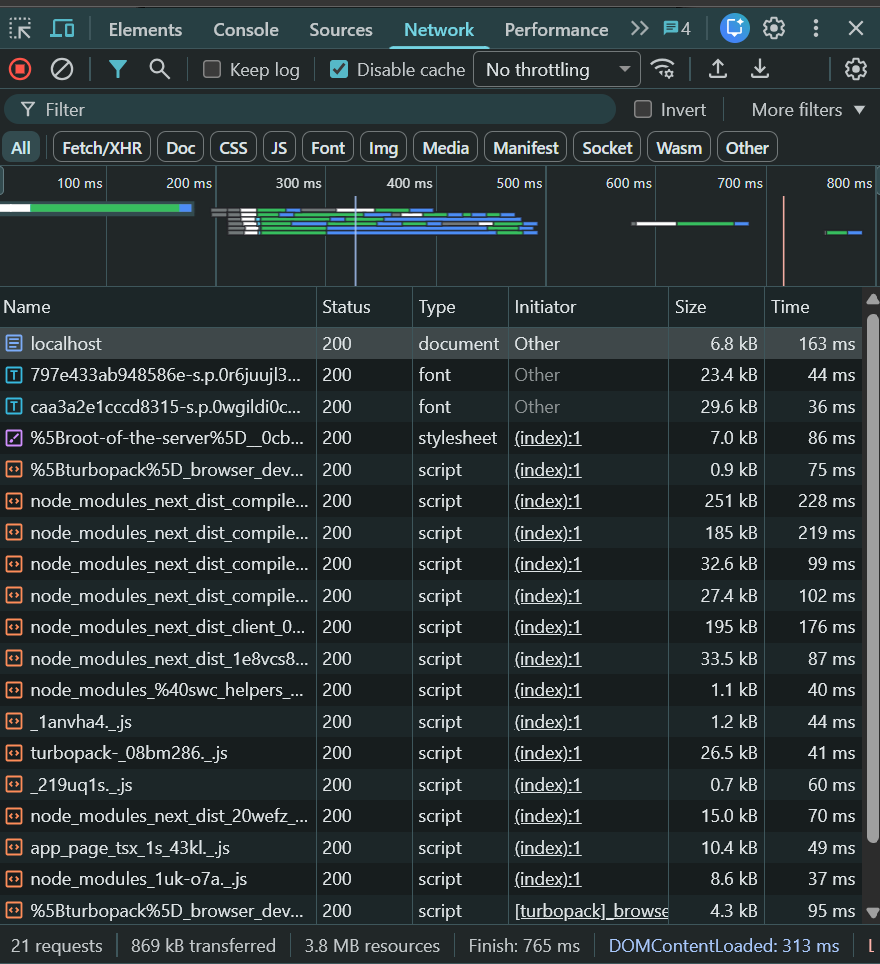
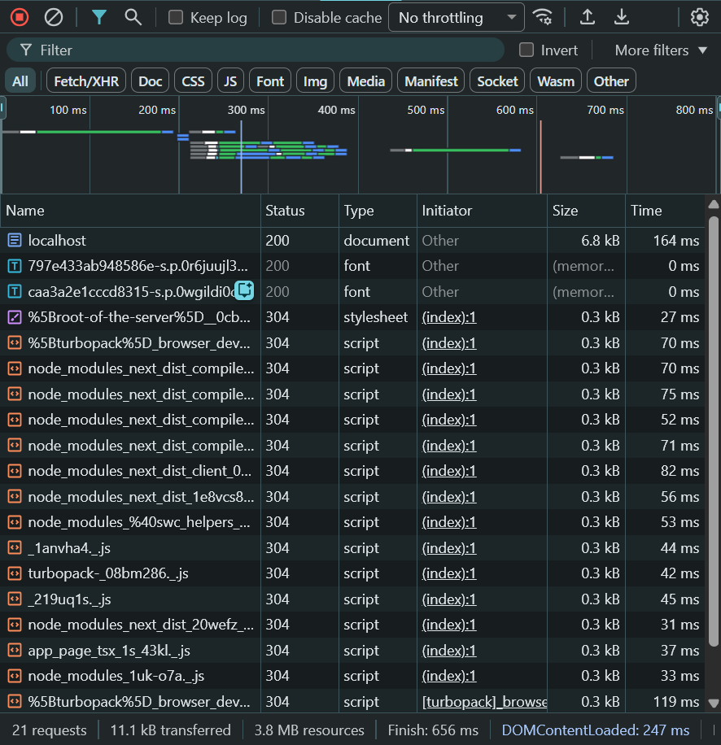

# Dokumen Teknis Modul 1 — Lingkungan Pengembangan, Git, dan Lalu Lintas HTTP

**Nama/NIM:** [Danu Dimas Putra / 105224003]  
**Repositori:** [https://github.com/danu44-1/Praktikum_Pem_WEB]  

---

## 1. Lingkungan Pengembangan

### 1.1 Deskripsi Proyek

CommentGuard merupakan antarmuka dashboard berbasis web yang dirancang untuk mendemonstrasikan sistem otomatisasi moderasi komentar YouTube.

Website ini memungkinkan pengguna untuk melihat daftar komentar, mengelola status komentar, mengatur aturan moderasi, serta menjalankan simulasi pemindaian komentar berdasarkan aturan yang telah diaktifkan.

Website dikembangkan menggunakan Next.js dan TypeScript dengan pendekatan komponen React.

**Tujuan pengembangan:**

1. Menampilkan antarmuka moderasi komentar yang modern dan mudah digunakan.
2. Mendemonstrasikan proses deteksi komentar yang berpotensi melanggar aturan.
3. Menyediakan fitur pengelolaan komentar berdasarkan status.
4. Memberikan informasi penggunaan sistem secara langsung pada halaman.
5. Menjadi prototipe antarmuka untuk pengembangan sistem moderasi yang lebih lanjut.

**Catatan:** Website yang dikembangkan pada modul ini masih berupa simulasi frontend. Sistem belum mengambil komentar dari YouTube dan belum melakukan pemblokiran komentar secara langsung pada platform YouTube.

### 1.2 Spesifikasi Lingkungan Pengembangan

| Komponen | Versi / Spesifikasi |
|---|---|
| Sistem Operasi | [Windows Version 10.0.26200] |
| Node.js | [v22.22.2] |
| npm | [v12.1.0] |
| Git | [git version 2.53.0.windows.1] |
| Visual Studio Code | [v1.139.1] |
| Framework | Next.js |
| Bahasa Pemrograman | TypeScript |
| Library UI | React |
| Styling | Tailwind CSS |
| Browser Pengujian | [Chrome] |

### 1.3 Perintah Pemeriksaan Lingkungan

Pemeriksaan lingkungan pengembangan dilakukan melalui terminal.

**Memeriksa versi Node.js:**

```bash
node -v
```

**Memeriksa versi npm:**

```bash
npm -v
```

**Memeriksa versi Git:**

```bash
git --version
```

Keluaran perintah digunakan untuk memastikan bahwa lingkungan pengembangan telah tersedia dan sesuai dengan kebutuhan proyek.

### 1.4 Struktur Proyek

Struktur utama proyek yang digunakan adalah sebagai berikut:

```text
commentguard/
├── app/
│   ├── globals.css
│   ├── layout.tsx
│   └── page.tsx
├── docs/
│   ├── praktikum/
│   |   └── modul-01.md
├── public/
├── node_modules/
├── package.json
├── package-lock.json
├── next.config.ts
├── tsconfig.json

```

Keterangan:

| File / Folder | Fungsi |
|---|---|
| `app/` | Menyimpan halaman dan konfigurasi tampilan utama aplikasi. |
| `app/page.tsx` | Implementasi dashboard CommentGuard. |
| `app/layout.tsx` | Layout utama aplikasi Next.js. |
| `app/globals.css` | Styling global aplikasi. |
| `docs/praktikum/modul-01.md` | Dokumentasi teknis proyek. |
| `public/` | Menyimpan aset statis seperti gambar dan ikon. |
| `package.json` | Menyimpan informasi proyek, dependensi, dan script. |
| `package-lock.json` | Menyimpan versi dependensi yang digunakan npm. |
| `next.config.ts` | Konfigurasi Next.js. |
| `tsconfig.json` | Konfigurasi TypeScript. |

Struktur di atas merupakan contoh struktur proyek Next.js. Penyesuaian dilakukan berdasarkan struktur aktual repositori.

---

## 2. Alur Kerja Git

### 2.1 Inisialisasi dan Pengelolaan Repositori

Git digunakan untuk mencatat perubahan kode selama proses pengembangan website.

Repositori GitHub digunakan sebagai tempat penyimpanan kode sumber dan dokumentasi proyek.

Perintah yang digunakan:

**Memeriksa status repositori:**

```bash
git status
```

**Menambahkan perubahan:**

```bash
git add .
```

**Membuat commit:**

```bash
git commit -m "Initialize Next.js application with TypeScript and Tailwind CSS setup"
```

**Menghubungkan repositori GitHub:**

```bash
git remote add origin https://github.com/danu44-1/Praktikum_Pem_WEB.git
```

**Mengirim perubahan ke GitHub:**

```bash
git push -u origin main
```

Perintah `git remote add origin` hanya digunakan apabila remote belum tersedia.

### 2.2 Alur Branch dan Pull Request

Alur kerja Git yang digunakan:

1. Membuat branch untuk pengembangan fitur.
2. Mengimplementasikan antarmuka pada `app/page.tsx`.
3. Menjalankan aplikasi dan melakukan pengujian.
4. Menyimpan perubahan menggunakan commit.
5. Mengirim branch ke repositori GitHub.
6. Membuat Pull Request.
7. Melakukan pemeriksaan perubahan kode.
8. Menggabungkan Pull Request ke branch utama.

Contoh pembuatan branch:

```bash
git switch -c feature/comment-moderation-dashboard
```

Contoh commit:

```bash
git add app/page.tsx
git commit -m "feat: add comment moderation dashboard"
```

Mengirim branch ke GitHub:

```bash
git push -u origin feature/comment-moderation-dashboard
```

**Tautan Pull Request yang telah digabungkan:**

https://github.com/danu44-1/Praktikum_Pem_WEB/pull/1

Status Pull Request: [Merged]

Branch dan Pull request yang telah ada tersebut merupakan test/pengujian untuk kebutuhan praktikum

### 2.3 Keluaran Git Log

Perintah berikut digunakan untuk melihat riwayat commit dalam bentuk grafis:

```bash
git log --oneline --graph
```

**Keluaran aktual:**

```text
*   e1aad78 (HEAD -> main, origin/main) Merge pull request #1 from danu44-1/week-1_003
|\  
| * c0ba3de (origin/week-1_003, week-1_003) Add login component to the application
|/  
* 7a9ae4a Update Modul 1 documentation with test results and AI prompt examples
* 6f16129 Add technical documentation and images for Modul 1
* 0ed8941 Initialize Next.js application with TypeScript and Tailwind CSS setup
```

Keluaran tersebut digunakan untuk memperlihatkan urutan perubahan kode, identitas commit, dan hubungan antarbranch.

### 2.4 Konflik Git

Konflik Git dapat terjadi ketika dua perubahan mengubah bagian kode yang sama dan Git tidak dapat menentukan perubahan yang harus dipertahankan secara otomatis.

Apabila konflik terjadi, langkah penyelesaian dilakukan sebagai berikut:

1. Menjalankan proses merge atau pull.
2. Memeriksa file yang mengalami konflik.
3. Membuka file dan mencari penanda konflik Git.
4. Membandingkan perubahan dari kedua branch.
5. Menentukan isi akhir berdasarkan kebutuhan fitur.
6. Menghapus penanda konflik.
7. Menjalankan aplikasi untuk memastikan kode tidak mengalami kesalahan.
8. Menambahkan dan melakukan commit terhadap hasil penyelesaian.

Contoh penanda konflik:

```text
<<<<<<< HEAD
Perubahan dari branch saat ini
=======
Perubahan dari branch yang digabungkan
>>>>>>> feature-branch
```

**Dokumentasi konflik:**

| Aspek | Keterangan |
|---|---|
| File yang mengalami konflik | [Nama file] |
| Penyebab konflik | [Penjelasan penyebab] |
| Perubahan pertama | [Isi perubahan pertama] |
| Perubahan kedua | [Isi perubahan kedua] |
| Penyelesaian | [Cara menyelesaikan konflik] |
| Alasan pemilihan isi akhir | [Alasan teknis] |

Apabila tidak terjadi konflik, tuliskan:

> Tidak terjadi konflik Git selama proses pengembangan modul ini.

---

## 3. Pengamatan Lalu Lintas HTTP

### 3.1 Tujuan Pengamatan

Pengamatan lalu lintas HTTP dilakukan untuk memahami proses komunikasi antara browser dan server ketika website CommentGuard diakses.

Pengamatan mencakup:

- Permintaan HTTP yang dikirim browser.
- Respons yang diterima dari server.
- Kode status HTTP.
- Ukuran data yang ditransfer.
- Pengaruh cache browser terhadap pemuatan halaman.
- Perbedaan metode HTTP HEAD dan GET.
- Pengalihan HTTP ke HTTPS pada GitHub.

### 3.2 Prosedur Pengamatan Menggunakan DevTools

Pengamatan dilakukan menggunakan browser Google Chrome.

Langkah-langkah:

1. Jalankan website menggunakan `npm run dev`.
2. Buka website melalui browser.
3. Tekan `F12` atau `Ctrl + Shift + I`.
4. Pilih tab Network.
5. Aktifkan opsi Disable cache untuk pengujian tanpa cache.
6. Muat ulang halaman menggunakan `Ctrl + R`.
7. Catat status HTTP dan ukuran data yang ditransfer.
8. Nonaktifkan Disable cache.
9. Muat ulang halaman kembali.
10. Catat hasil pengujian dengan cache.
11. Ambil tangkapan layar sebagai bukti pengamatan.

### 3.3 Lembar Kerja Pengamatan — Tabel 9

**Tabel 9. Hasil Pengamatan Lalu Lintas HTTP**

| No. | Kondisi Pengujian | URL / Resource | Status HTTP | Ukuran Transfer | Keterangan |
|---|---|---|---|---|---|
| 1 | Tanpa cache | http://localhost:3000/ | 200 | 6.8 kB | Over Network |
| 2 | Dengan cache | http://localhost:3000/ | 200 | 6.8 kB | Over Network |
| 3 | Tanpa cache | http://localhost:3000/_next/static/chunks/%5Bturbopack%5D_browser_dev_hmr-client_hmr-client_ts_1di75ot._.js | 200 | 0.9 kB | Over Network |
| 4 | Dengan cache | http://localhost:3000/_next/static/chunks/%5Bturbopack%5D_browser_dev_hmr-client_hmr-client_ts_1di75ot._.js | 304 | 0.3 kB | Over Network |
| 5 | Tanpa cache | http://localhost:3000/_next/static/chunks/%5Broot-of-the-server%5D__0cbk-n2._.css | 200 | 7.0 kB | Over Network |
| 6 | Dengan cache | http://localhost:3000/_next/static/chunks/%5Broot-of-the-server%5D__0cbk-n2._.css | 304 | 0.3 kB | Over Network |

**Catatan pengisian:**

- Status HTTP diambil dari kolom Status pada DevTools Network.
- Ukuran transfer diambil dari kolom Size.
- Apabila resource berasal dari cache, catat keterangan seperti `memory cache` atau `disk cache`.
- Apabila resource tidak ditemukan, tuliskan `Tidak tersedia`.
- Gunakan URL dan hasil pengamatan aktual dari browser.

### 3.4 Tangkapan Layar DevTools

#### A. Pengujian Tanpa Cache



Keterangan:

Tangkapan layar menunjukkan permintaan resource ketika browser melakukan pemuatan halaman tanpa menggunakan cache browser.

#### B. Pengujian Dengan Cache



Keterangan:

Tangkapan layar menunjukkan permintaan resource ketika browser diperbolehkan menggunakan cache yang tersedia.

### 3.5 Pengamatan Menggunakan curl -I

Perintah `curl -I` digunakan untuk mengirim permintaan HTTP dengan metode HEAD.

Contoh pengujian terhadap website lokal:

```bash
curl -I http://localhost:3000
```

Contoh pengujian terhadap GitHub:

```bash
curl -I http://github.com
```

**Keluaran aktual:**

```text
HTTP/1.1 200 OK
Vary: rsc, next-router-state-tree, next-router-prefetch, next-router-segment-prefetch, Accept-Encoding
Link: </_next/static/media/797e433ab948586e-s.p.0r6juujl39pe6.woff2>; rel=preload; as="font"; crossorigin="";type="font/woff2", </_next/static/media/caa3a2e1cccd8315-s.p.0wgildi0cnwt9.woff2>; rel=preload; as="font"; crossorigin=""; type="font/woff2"
Cache-Control: no-cache, must-revalidate
X-Powered-By: Next.js
Content-Type: text/html; charset=utf-8
Date: Sun, 27 Sep 2026 23:33:14 GMT
Connection: keep-alive
Keep-Alive: timeout=5

HTTP/1.1 301 Moved Permanently
Content-Length: 0
Location: https://github.com/
```

Informasi yang diamati:

- Status HTTP.
- Header Content-Type.
- Header Content-Length apabila tersedia.
- Header Location apabila terjadi pengalihan.
- Header Cache-Control apabila tersedia.

Metode HEAD digunakan untuk memperoleh informasi header respons tanpa meminta isi body respons seperti pada GET.

Metode ini berguna untuk memeriksa informasi dasar resource tanpa harus mengunduh seluruh isi halaman.

### 3.6 Pengamatan Menggunakan curl -v

Perintah `curl -v` digunakan untuk menampilkan informasi proses komunikasi HTTP secara lebih terperinci.

Contoh:

```bash
curl -v http://localhost:3000
```

Pengujian pengalihan GitHub:

```bash
curl -v http://github.com
```

**Keluaran aktual:**

```text
* Host localhost:3000 was resolved.
* IPv6: ::1
* IPv4: 127.0.0.1
*   Trying [::1]:3000...
* Established connection to localhost (::1 port 3000) from ::1 port 64169 
* using HTTP/1.x
> GET / HTTP/1.1
> Host: localhost:3000
> User-Agent: curl/8.18.0
> Accept: */*
> 
* Request completely sent off
< HTTP/1.1 200 OK
< Vary: rsc, next-router-state-tree, next-router-prefetch, next-router-segment-prefetch, Accept-Encoding
< Link: </_next/static/media/797e433ab948586e-s.p.0r6juujl39pe6.woff2>; rel=preload; as="font"; crossorigin=""; type="font/woff2", </_next/static/media/caa3a2e1cccd8315-s.p.0wgildi0cnwt9.woff2>; rel=preload; as="font"; crossorigin=""; type="font/woff2"
< Cache-Control: no-cache, must-revalidate
< X-Powered-By: Next.js
< Content-Type: text/html; charset=utf-8
< Date: Sun, 27 Sep 2026 23:35:26 GMT
< Connection: keep-alive
< Keep-Alive: timeout=5
< Transfer-Encoding: chunked
< 
<!DOCTYPE html><html lang="en" ...

* Host github.com:80 was resolved.
* IPv6: (none)
* IPv4: 20.205.243.166
*   Trying 20.205.243.166:80...
* Established connection to github.com (20.205.243.166 port 80) from 192.168.0.101 port 54237 
* using HTTP/1.x
> GET / HTTP/1.1
> Host: github.com
> User-Agent: curl/8.18.0
> Accept: */*
> 
* Request completely sent off
< HTTP/1.1 301 Moved Permanently
< Content-Length: 0
< Location: https://github.com/
< 
* Connection #0 to host github.com:80 left intact
```

Informasi yang diamati meliputi:

- Alamat server yang dihubungi.
- Metode HTTP yang digunakan.
- Header permintaan.
- Header respons.
- Status HTTP.
- Informasi pengalihan.
- Informasi koneksi.

Perintah `curl -v` membantu mengamati proses komunikasi HTTP secara lebih detail dibandingkan `curl -I`.

### 3.7 Analisis Hasil Pengamatan

#### A. Perbedaan Pemuatan Dengan dan Tanpa Cache

Cache browser digunakan untuk menyimpan resource tertentu agar dapat digunakan kembali pada pemuatan berikutnya.

Pada pengujian tanpa cache, browser diminta untuk mengambil kembali resource dari server.

Pada pengujian dengan cache, browser dapat menggunakan resource yang sebelumnya telah disimpan apabila resource tersebut masih valid dan kebijakan cache mengizinkannya.

Perbedaan yang dapat diamati:

| Aspek | Tanpa Cache | Dengan Cache |
|---|---|---|
| Pengambilan resource | Meminta resource kembali dari server | Dapat menggunakan resource tersimpan |
| Ukuran transfer | Dapat lebih besar | Dapat lebih kecil |
| Waktu pemuatan | Dapat lebih lama | Dapat lebih cepat |
| Status HTTP | Bergantung pada respons server | Dapat menunjukkan respons cache atau validasi |
| Ketergantungan jaringan | Lebih tinggi | Dapat lebih rendah |

Ukuran transfer tidak selalu sama dengan ukuran file asli. Browser dapat menggunakan kompresi, cache, atau validasi resource sehingga hasil aktual dapat berbeda.

#### B. Alasan curl -I Menggunakan Metode HEAD

Opsi `-I` pada curl digunakan untuk mengirim permintaan HTTP HEAD.

Metode HEAD meminta informasi header dari resource tanpa meminta body respons.

Oleh karena itu, hasil `curl -I` dapat digunakan untuk memeriksa status dan header HTTP tanpa mengunduh isi halaman secara penuh.

#### C. Alasan http://github.com Dialihkan

GitHub mengarahkan akses HTTP menuju HTTPS untuk menggunakan koneksi yang terenkripsi.

HTTPS menggunakan TLS untuk membantu melindungi komunikasi antara browser atau client dengan server.

Pada pengujian menggunakan `curl -v`, pengalihan dapat diamati melalui status HTTP dan header `Location`.

Contoh alur pengalihan:

```text
http://github.com
        |
        | HTTP Redirect
        v
https://github.com
```

Status pengalihan yang diterima harus dicatat berdasarkan hasil pengujian aktual.

---

## 4. Kendala dan Penyelesaian

Bagian ini mencatat kendala yang ditemukan selama pengembangan dan pengujian website.

### 4.1 Kendala Implementasi Antarmuka

| Kendala | Penyebab | Penyelesaian |
|---|---|---|
| Tampilan tidak responsif | Ukuran layar berbeda | Menggunakan layout responsif Tailwind CSS |
| Komponen tidak diperbarui | State React belum dikelola dengan benar | Menggunakan useState dan pembaruan state |
| Komentar tidak sesuai filter | Logika pencarian dan status belum sesuai | Menggunakan filter berdasarkan status dan kata kunci |
| Status komentar tidak berubah | Event handler belum terhubung | Menghubungkan aksi ke fungsi updateComment |

Kendala pada tabel perlu disesuaikan dengan masalah yang benar-benar ditemukan selama pengembangan.

### 4.2 Kendala Pengujian HTTP

| Kendala | Penyelesaian |
|---|---|
| Website lokal belum dapat diakses | Memastikan server Next.js berjalan |
| DevTools tidak menampilkan resource | Memeriksa tab Network dan memuat ulang halaman |
| Cache tidak memberikan hasil yang berbeda | Memeriksa kebijakan cache dan resource yang diuji |
| curl tidak tersedia | Menggunakan terminal yang mendukung curl atau memasang curl |

### 4.3 Evaluasi dan Pengembangan Selanjutnya

Pengembangan selanjutnya dapat mencakup:

1. Integrasi autentikasi akun YouTube.
2. Integrasi YouTube Data API.
3. Pengambilan komentar dari video yang dipilih.
4. Pengelolaan aturan moderasi melalui backend.
5. Penyimpanan riwayat moderasi.
6. Penambahan sistem konfirmasi sebelum tindakan moderasi.
7. Pengujian keamanan dan validasi akses.

Integrasi nyata memerlukan pemeriksaan terhadap izin API, kebijakan YouTube, dan batas penggunaan API yang berlaku.

---

## 5. Catatan Pemanfaatan AI

### 5.1 Alat AI yang Digunakan

**Nama alat:** ChatGPT  
**Model:** GPT-5.6 Luna  
**Tujuan penggunaan:** Membantu pengembangan antarmuka dan penyusunan dokumentasi teknis.

### 5.2 Perintah Utama

Contoh prompt yang digunakan:

> You are a senior developer; create a simple interface for automatization blocked comment on youtube for presentation in page.tsx the rules are simple use color red, modern, and show how to use for inform in page the output need to be a single file on page.tsx that can be run after finished.

Prompt dokumentasi:

> then, create a technical document for after create that website on page.tsx using this format .md in bottom to show and inform this website the output need to be a single file on modul-01.md that can be inform clearly to other # Dokumen Teknis Modul 1 — Lingkungan Pengembangan, Git, dan Lalu Lintas HTTP ...

### 5.3 Bagian yang Dibantu AI

| Bagian | Pemanfaatan AI |
|---|---|
| Antarmuka | Membantu menyusun layout dashboard moderasi komentar |
| Komponen React | Membantu membuat komponen statistik, tabel komentar, dan panduan |
| Logika frontend | Membantu membuat simulasi pemindaian dan pengelolaan status komentar |
| Dokumentasi | Membantu menyusun struktur dokumentasi teknis Markdown |
| Penjelasan | Membantu menjelaskan fungsi fitur dan alur penggunaan |

### 5.4 Verifikasi Hasil AI

Hasil yang dihasilkan AI perlu diperiksa sebelum digunakan.

Verifikasi dilakukan dengan:

1. Menjalankan website menggunakan `npm run dev`.
2. Memeriksa apakah halaman dapat dimuat.
3. Menguji tombol Run scan.
4. Menguji perubahan status komentar.
5. Menguji fitur pencarian dan filter.
6. Menguji pengaturan aturan moderasi.
7. Memeriksa tampilan pada ukuran layar berbeda.
8. Memeriksa keluaran Git dan DevTools secara langsung.

AI digunakan sebagai alat bantu pengembangan. Keputusan akhir terhadap kode, pengujian, dan hasil implementasi tetap dilakukan oleh pengembang.

---

**Akhir Dokumen Teknis Modul 1**