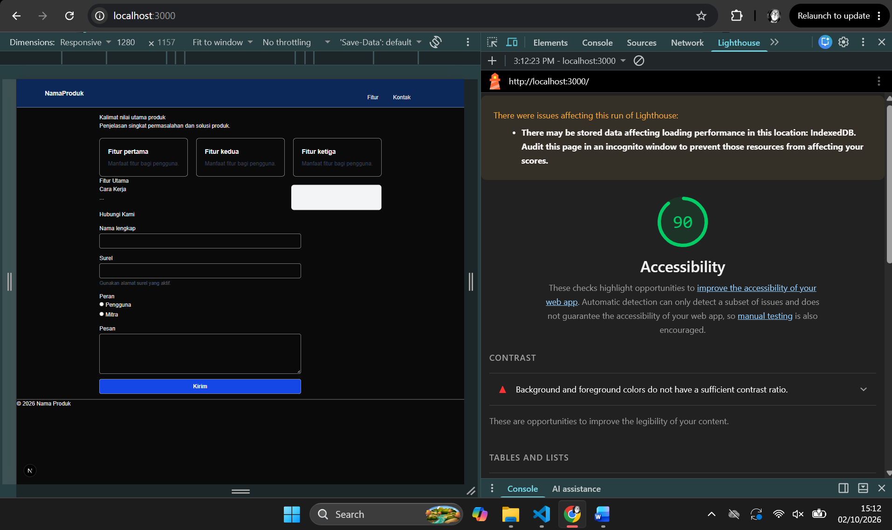
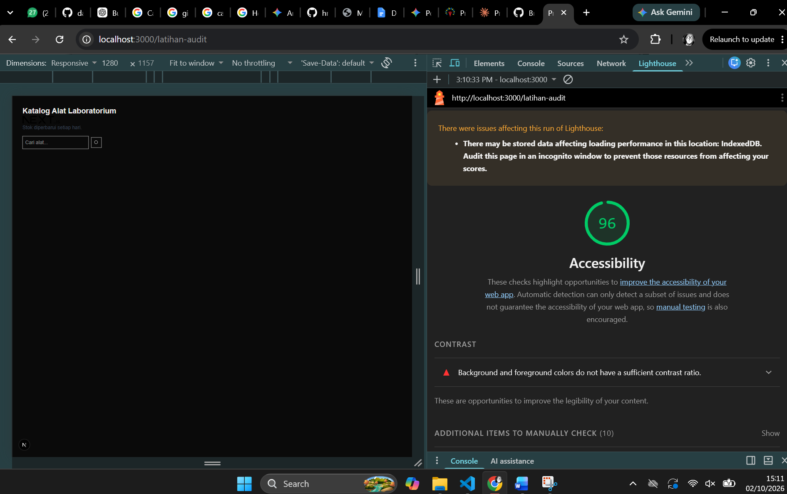

# Dokumen Teknis Modul 2 — HTML Semantik, Tailwind CSS, dan Aksesibilitas

**Nama/NIM** :  
**Repositori** :  

> **Ruang lingkup pemeriksaan:** dokumen ini disusun berdasarkan kode yang tersedia pada `app/page.tsx`, `app/latihan-audit/page.tsx`, dan `app/globals.css`.  
> **Catatan bukti:** arsip yang diperiksa tidak menyertakan screenshot DevTools/Lighthouse. Karena itu, skor Lighthouse dan tangkapan layar tidak dibuat-buat; bagian tersebut diberi status **belum tersedia** dan dapat diisi setelah pengujian aktual dilakukan.

---

## 1. Struktur Semantik

### 1.1 Halaman utama — `app/page.tsx`

Halaman utama menggunakan struktur landmark HTML yang secara umum sudah mengarah pada struktur semantik yang benar:

```text
<body>
└── <>
    ├── Skip Link
    │   └── <a href="#konten">Lewati ke konten utama</a>
    │
    ├── <header>
    │   └── <nav aria-label="Navigasi utama">
    │       ├── <Link href="/">NamaProduk</Link>
    │       └── <ul>
    │           ├── <li><a href="#fitur">Fitur</a></li>
    │           └── <li><a href="#kontak">Kontak</a></li>
    │
    ├── <main id="konten">
    │   ├── <section aria-labelledby="judul-utama">
    │   │   ├── <h1 id="judul-utama">
    │   │   └── <p>
    │   │
    │   ├── <section id="fitur" aria-labelledby="judul-fitur">
    │   │   ├── <h2 id="judul-fitur">Fitur Utama</h2>
    │   │   ├── <ul>
    │   │   │   └── <li>
    │   │   │       └── <article>
    │   │   │           ├── <h3>
    │   │   │           └── <p>
    │   │   │
    │   │   └── <div>
    │   │       ├── <section aria-labelledby="judul-cara">
    │   │       │   └── <h2 id="judul-cara">Cara Kerja</h2>
    │   │       └── <aside aria-label="Informasi tambahan">
    │   │
    │   └── <section id="kontak" aria-labelledby="judul-kontak">
    │       ├── <h2 id="judul-kontak">Hubungi Kami</h2>
    │       └── <form>
    │           ├── Nama lengkap
    │           ├── Surel
    │           ├── Peran
    │           └── Pesan
    │
    └── <footer>
        └── <p>© 2026 Nama Produk</p>
```

### 1.2 Landmark yang digunakan

| Elemen | Fungsi |
|---|---|
| `<header>` | Area kepala halaman dan navigasi utama |
| `<nav aria-label="Navigasi utama">` | Menandai landmark navigasi utama |
| `<main id="konten">` | Menandai konten utama halaman |
| `<section>` | Mengelompokkan bagian halaman berdasarkan topik |
| `<article>` | Membungkus setiap kartu fitur sebagai unit konten |
| `<aside>` | Menampung informasi tambahan pada bagian Cara Kerja |
| `<form>` | Mengelompokkan kontrol input untuk kontak |
| `<footer>` | Area informasi penutup halaman |

### 1.3 Hierarki heading

Hierarki heading yang dimaksud oleh kode adalah:

```text
H1  Kalimat nilai utama produk
│
├── H2  Fitur Utama
│   └── H3  Fitur pertama / kedua / ketiga
│
├── H2  Cara Kerja
│
└── H2  Hubungi Kami
```

Namun, implementasi aktual menempatkan daftar kartu fitur **sebelum** `<h2 id="judul-fitur">Fitur Utama</h2>`. Selain itu, `<h3>` pada kartu fitur secara semantik muncul sebelum heading `<h2>` yang seharusnya menaungi bagian tersebut.

**Perbaikan yang disarankan:**

```tsx
<section id="fitur" aria-labelledby="judul-fitur">
  <h2 id="judul-fitur">Fitur Utama</h2>

  <ul>
    {fitur.map((f) => (
      <li key={f.judul}>
        <article>
          <h3>{f.judul}</h3>
          <p>{f.deskripsi}</p>
        </article>
      </li>
    ))}
  </ul>

  {/* bagian Cara Kerja */}
</section>
```

### 1.4 Tangkapan layar pohon aksesibilitas DevTools

**Status: belum tersedia pada arsip yang diperiksa.**

Setelah aplikasi dijalankan, buka:

`Chrome DevTools → Elements → Accessibility`

Kemudian dokumentasikan struktur landmark dan heading halaman utama. Screenshot yang diharapkan memperlihatkan minimal:

```text
main
├── heading level 1
├── region/section — Fitur Utama
│   ├── heading level 2
│   ├── article
│   │   └── heading level 3
│   └── ...
└── region/section — Hubungi Kami
    └── heading level 2
```

---

## 2. Tata Letak Responsif

### 2.1 Halaman utama

Tailwind CSS digunakan melalui:

```css
@import "tailwindcss";
```

Warna brand juga didefinisikan melalui konfigurasi tema:

```css
@theme inline {
  --color-brand: #0b2858;
}
```

### 2.2 Flexbox

Navigasi utama menggunakan Flexbox:

```tsx
className="
  mx-auto flex max-w-6xl flex-col gap-3 p-4
  sm:flex-row sm:items-center sm:justify-between
"
```

Fungsinya:

- `flex` mengaktifkan Flexbox.
- `flex-col` membuat navigasi tersusun vertikal pada layar kecil.
- `sm:flex-row` mengubah susunan menjadi horizontal mulai breakpoint `sm`.
- `sm:items-center` menyelaraskan item secara vertikal.
- `sm:justify-between` memberi jarak antara identitas produk dan menu.
- `gap-3` memberi jarak antar-item.

Pendekatan ini sesuai untuk navigasi desktop-first yang tetap dapat turun menjadi susunan vertikal pada viewport kecil.

### 2.3 Grid kartu fitur

Kartu fitur menggunakan:

```tsx
className="mt-6 grid grid-cols-3 gap-6"
```

Artinya:

- `grid` mengaktifkan CSS Grid.
- `grid-cols-3` selalu membentuk tiga kolom.
- `gap-6` memberi jarak antar kartu.

**Catatan responsivitas:** implementasi saat ini belum memiliki breakpoint untuk grid tersebut. Pada lebar 360 px, tiga kolom berpotensi membuat konten terlalu sempit.

Versi yang lebih responsif disarankan:

```tsx
className="mt-6 grid grid-cols-1 gap-6 sm:grid-cols-2 lg:grid-cols-3"
```

Dengan demikian:

```text
< 640 px       → 1 kolom
≥ 640 px       → 2 kolom
≥ 1024 px      → 3 kolom
```

### 2.4 Grid bagian Cara Kerja

Bagian Cara Kerja menggunakan:

```tsx
className="grid gap-8 lg:grid-cols-[2fr_1fr]"
```

Interpretasinya:

```text
Mobile / tablet
┌────────────────────────────┐
│        Konten utama         │
│        Cara Kerja           │
├────────────────────────────┤
│      Informasi tambahan     │
└────────────────────────────┘

Desktop ≥ lg
┌──────────────────────┬───────────────┐
│      Cara Kerja      │    Aside      │
│        2fr           │      1fr      │
└──────────────────────┴───────────────┘
```

`lg:grid-cols-[2fr_1fr]` dipilih agar konten utama mendapatkan ruang lebih besar dibanding informasi tambahan.

### 2.5 Halaman latihan audit — `app/latihan-audit/page.tsx`

Halaman latihan menggunakan:

```tsx
<main className="p-8">
```

dan bagian pencarian:

```tsx
<div className="mt-4 flex items-center">
```

`flex items-center` membuat input pencarian dan tombol berada dalam satu baris serta sejajar secara vertikal.

Namun, halaman latihan **belum memiliki breakpoint Tailwind** seperti `sm:`, `md:`, atau `lg:`. Pada viewport kecil, komponen pencarian belum memiliki aturan khusus untuk berubah menjadi susunan vertikal.

Versi yang lebih aman untuk mobile:

```tsx
<div className="mt-4 flex flex-col gap-2 sm:flex-row sm:items-center">
```

### 2.6 Target screenshot responsif

Screenshot aktual tidak terdapat dalam arsip. Pengujian yang perlu dilakukan:

| Viewport | Halaman utama | Halaman latihan audit | Bukti |
|---|---|---|---|
| 360 px | Belum diuji pada arsip | Belum diuji pada arsip | Screenshot aktual diperlukan |
| 768 px | Belum diuji pada arsip | Belum diuji pada arsip | Screenshot aktual diperlukan |
| 1280 px | Belum diuji pada arsip | Belum diuji pada arsip | Screenshot aktual diperlukan |

**Checklist pemeriksaan:**

- Tidak ada horizontal scrolling.
- Teks tetap terbaca.
- Navigasi tidak bertumpuk secara tidak wajar.
- Kartu fitur tidak terlalu sempit.
- Form kontak tetap dapat digunakan.
- Input dan tombol tetap terlihat dan dapat diakses.

---

## 3. Audit Aksesibilitas

### 3.1 Halaman utama

Implementasi halaman utama sudah memiliki beberapa praktik aksesibilitas yang baik.

| Implementasi | Status | Penjelasan |
|---|---|---|
| Skip link ke `#konten` | Baik | Membantu pengguna keyboard melewati navigasi |
| `<nav aria-label="Navigasi utama">` | Baik | Landmark navigasi diberi nama |
| `<main id="konten">` | Baik | Menyediakan target skip link dan landmark utama |
| `aria-labelledby` pada section | Baik | Section memiliki nama yang berasal dari heading |
| `<label htmlFor>` pada input | Baik | Label terhubung dengan kontrol |
| `fieldset` + `legend` untuk Peran | Baik | Radio group diberi konteks semantik |
| `aria-describedby` pada email | Baik | Bantuan email dikaitkan dengan input |
| `aria-hidden="true"` pada SVG | Baik | Ikon dekoratif tidak dibaca screen reader |
| `focus-visible:outline-*` | Baik | Terdapat indikator fokus untuk keyboard |
| `required` pada Nama dan Surel | Baik | Field wajib dinyatakan pada HTML |



### 3.2 Halaman latihan audit

Kode `app/latihan-audit/page.tsx` memiliki:

```tsx
<h1>Katalog Alat Laboratorium</h1>
```

sehingga halaman mempunyai heading utama.

Input pencarian juga mempunyai label:

```tsx
<label htmlFor="cari-alat" className="sr-only">
  Cari alat
</label>
```

Walaupun label disembunyikan secara visual, label tersebut tetap tersedia untuk teknologi bantu.

Tombol pencarian memiliki:

```tsx
aria-label="Cari"
```

dan SVG diberi:

```tsx
aria-hidden="true"
```

Sehingga ikon tidak menjadi satu-satunya informasi yang diberikan kepada pembaca layar.



### 3.3 Daftar audit gagal, penyebab dan perbaikannya

#### A. Button tidak memiliki nama akses

Kode sebelumnya memiliki pola:

```tsx
<button className="ml-2 border p-2">
```

<button> akan tetap dibaca sebagai button oleh screen readers, namun akan menjadi tidak biasa oleh user ketika diumumkan atau diperdengarkan sebagai button yang tidak dimaksudkan sebagai apapun dan membuat kebingungan.

**Perbaikan:**

```tsx
<button 
          type="button" 
          aria-label="Cari" 
          className="ml-2 border p-2"
        >
```

#### B. Element image tidak memiliki atribut alt

Kode sebelumnya:

```tsx

```

informasi element image tidak memiliki alt sebagai arti/maksud dari gambar tersebut, apakah untuk dekorasi atau kepentingan tertentu. 

**Perbaikan:** 

```tsx

```

#### C. Element form tidak memiliki label

Kode sebelumnya:

```tsx
<input type="search" className="border p-2" />
```

form element input tidak memiliki placeholder atau label tertentu untuk dimaksudkan apa input tersebut digunakan.

**Perbaikan:**

```tsx
<input 
          id="cari-alat" 
          type="search" 
          className="border p-2" 
          placeholder="Cari alat..." 
        />
```

Penambahan placeholder akan membantu user untuk mengerti fungsi dari input tersebut.

#### D. Indikator fokus

Halaman utama sudah menyediakan:

```tsx
focus-visible:outline-2
focus-visible:outline-offset-2
focus-visible:outline-blue-700
```

Ini merupakan pendekatan yang baik karena indikator fokus diterapkan ketika elemen dinavigasi dengan mekanisme yang membutuhkan visible focus.

Namun, halaman latihan belum memberikan styling `focus-visible` khusus pada input dan tombol. Browser masih dapat memberikan indikator fokus default, tetapi hasil aktual perlu diverifikasi.

### 3.4 Tabel skor Lighthouse

| Halaman | Kondisi | Accessibility |
|---|---|---:|
| Halaman utama `/` | Sebelum perbaikan | 90 |
| Halaman utama `/` | Sesudah perbaikan | 90 |
| Latihan `/latihan-audit` | Sebelum perbaikan | 76 |
| Latihan `/latihan-audit` | Sesudah perbaikan | 96 |

### 3.5 Cara mengambil skor Lighthouse

Untuk mendapatkan data aktual:

1. Jalankan aplikasi Next.js.
2. Buka halaman `/`.
3. Buka Chrome DevTools.
4. Pilih **Lighthouse**.
5. Pilih kategori:
   - Performance
   - Accessibility
   - Best Practices
   - SEO
6. Jalankan audit pada mode yang konsisten.
7. Simpan screenshot atau hasil laporan.
8. Ulangi langkah yang sama untuk `/latihan-audit`.
9. Lakukan perbaikan.
10. Jalankan audit kembali untuk memperoleh data **sesudah perbaikan**.

### 3.6 Pemeriksaan manual dengan papan ketik

Urutan fokus yang seharusnya diperiksa pada halaman utama:

```text
1. Skip link
2. Link NamaProduk
3. Link Fitur
4. Link Kontak
5. Input Nama lengkap
6. Input Surel
7. Radio Pengguna
8. Radio Mitra
9. Textarea Pesan
10. Tombol Kirim
```

Urutan aktual harus diverifikasi menggunakan tombol:

```text
Tab       → fokus berikutnya
Shift+Tab → fokus sebelumnya
Enter     → mengaktifkan link/button
Space     → mengaktifkan button atau pilihan tertentu
```

**Garis fokus:** fokus harus terlihat jelas ketika berpindah antar-elemen interaktif. Pada halaman utama, input dan tombol menggunakan class:

```text
focus-visible:outline-2
focus-visible:outline-offset-2
focus-visible:outline-blue-700
```

Pada halaman latihan, fokus visual masih perlu diperiksa secara manual pada:

```text
Input "Cari alat"
Tombol "Cari"
```

---

## 4. Kendala dan Penyelesaian

### 4.1 Struktur navigasi tidak semantik

**Kendala:** terdapat `<ul>` yang membungkus `<ul>` tanpa `<li>` sebagai parent.

**Dampak:** struktur accessibility tree dapat menjadi tidak sesuai dengan maksud navigasi dan struktur HTML menjadi tidak valid.

**Penyelesaian:** gunakan satu `<ul>` dengan `<li>` langsung sebagai anak:

```tsx
<ul>
  <li><a href="#fitur">Fitur</a></li>
  <li><a href="#kontak">Kontak</a></li>
</ul>
```

### 4.2 Urutan heading kurang tepat

**Kendala:** `<h3>` kartu fitur berada sebelum `<h2>Fitur Utama>`.

**Penyelesaian:** tempatkan `<h2>` sebelum daftar kartu, kemudian gunakan `<h3>` untuk judul masing-masing kartu.

### 4.3 Responsivitas grid kartu

**Kendala:** `grid-cols-3` tetap menggunakan tiga kolom pada semua ukuran layar.

**Penyelesaian:**

```tsx
grid-cols-1 sm:grid-cols-2 lg:grid-cols-3
```

### 4.4 Responsivitas halaman latihan

**Kendala:** komponen pencarian menggunakan Flexbox satu baris tanpa breakpoint.

**Penyelesaian:**

```tsx
flex flex-col gap-2 sm:flex-row sm:items-center
```

Dengan demikian pada layar kecil input dan tombol dapat tersusun vertikal, lalu kembali horizontal pada layar yang lebih besar.

### 4.5 Data audit belum tersedia

**Kendala:** kode yang diberikan tidak menyertakan hasil Lighthouse maupun screenshot DevTools.

**Penyelesaian:** lakukan audit langsung pada aplikasi yang sedang dijalankan dan masukkan hasil aktual ke dokumen ini. Nilai Lighthouse tidak boleh disimpulkan hanya dari pembacaan source code.

---

## 5. Catatan Pemanfaatan AI

**Alat:** ChatGPT.

**Perintah utama:** analisis kode `app/page.tsx`, `app/latihan-audit/page.tsx`, dan `app/globals.css` untuk mengidentifikasi struktur HTML semantik, penggunaan Tailwind CSS, responsivitas, dan potensi masalah aksesibilitas.

**Bagian yang digunakan:**

- Identifikasi landmark HTML seperti `<header>`, `<nav>`, `<main>`, `<section>`, `<article>`, `<aside>`, dan `<footer>`.
- Analisis hierarki heading.
- Analisis class Tailwind `flex`, `grid`, `sm:*`, dan `lg:*`.
- Identifikasi implementasi skip link.
- Identifikasi hubungan `<label>` dengan `<input>`.
- Identifikasi penggunaan `fieldset` dan `legend`.
- Identifikasi penggunaan `aria-label`, `aria-labelledby`, `aria-describedby`, dan `aria-hidden`.
- Identifikasi potensi masalah struktur `<ul>` dan urutan heading.
- Penyusunan rekomendasi perbaikan responsivitas.

**Cara memverifikasi hasil AI:**

1. Membandingkan setiap temuan dengan source code asli.
2. Menjalankan aplikasi dan memeriksa halaman `/` serta `/latihan-audit`.
3. Memeriksa Accessibility Tree melalui Chrome DevTools.
4. Melakukan navigasi menggunakan keyboard.
5. Menjalankan Lighthouse sebelum dan sesudah perbaikan.
6. Menggunakan hasil audit aktual sebagai sumber nilai final, bukan rekomendasi AI.

> **Catatan penting:** AI digunakan sebagai alat bantu analisis. Hasil akhir tetap perlu diverifikasi melalui browser, DevTools, Lighthouse, dan pengujian manual.

---

## Ringkasan Temuan

| Area | Kondisi dari kode | Prioritas |
|---|---|---|
| Landmark | Sudah menggunakan landmark semantik utama | Baik |
| Skip link | Sudah tersedia pada halaman utama | Baik |
| Form labeling | Sudah menggunakan `label`, `htmlFor`, `fieldset`, dan `legend` | Baik |
| ARIA | Digunakan pada beberapa bagian secara tepat | Baik |
| Fokus keyboard | Halaman utama memiliki `focus-visible` | Baik |
| Struktur navigasi | `<ul>` bersarang secara tidak tepat | **Perlu diperbaiki** |
| Heading | `<h3>` fitur muncul sebelum `<h2>` Fitur Utama | **Perlu diperbaiki** |
| Grid fitur | `grid-cols-3` belum responsif | **Perlu diperbaiki** |
| Latihan audit | Belum memiliki breakpoint responsif | **Perlu diperbaiki** |